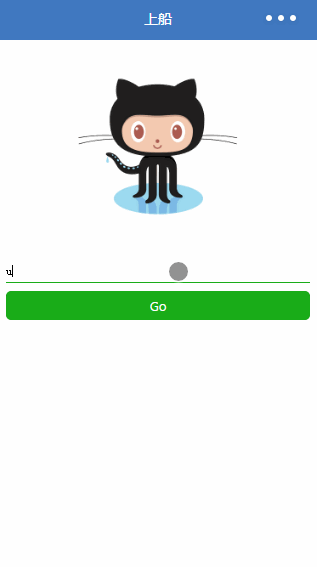
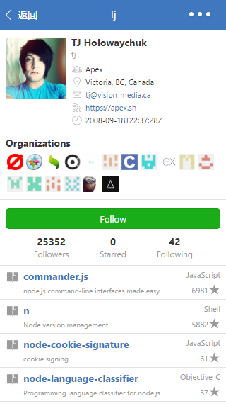

### GitHub Feed 小程序版
参考：[react-native-gitfeed](https://github.com/xiekw2010/react-native-gitfeed)

### 已完成的功能

### 一些痛点
- 不支持 WebView ，故不能使用 OAuth2 获得 GitHub 授权，目前会有每小时 60 次的 API 请求限制 ;
- wx.request() 这个网络请求的 API 封装的太简单粗暴，以至于不能获取响应头中的其他域，如 Link ;
- 不支持 ES2015 原生的 Promise，故不得不引入第三方的 Promise 库，此处使用的是 bluebird ;